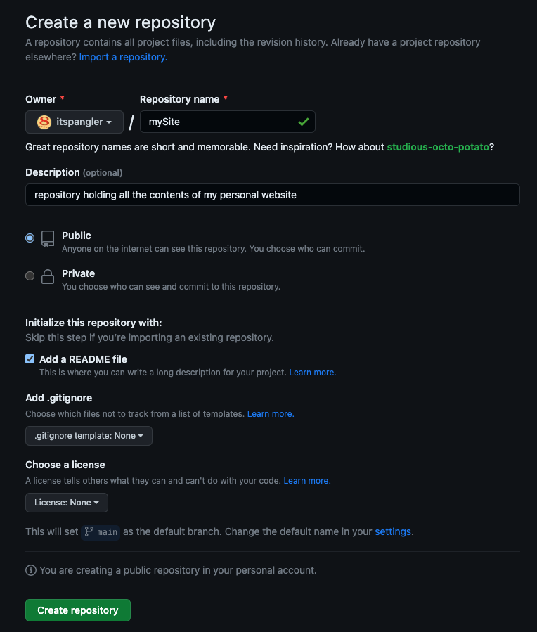
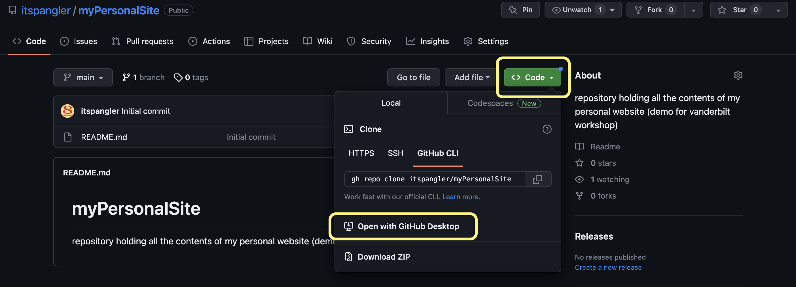
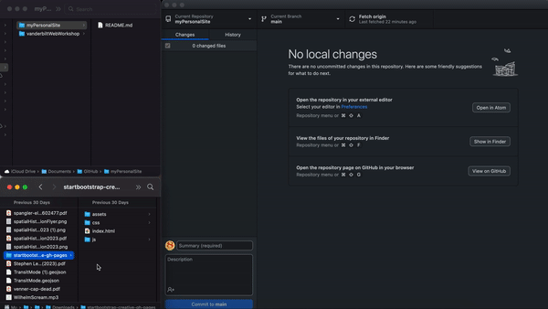
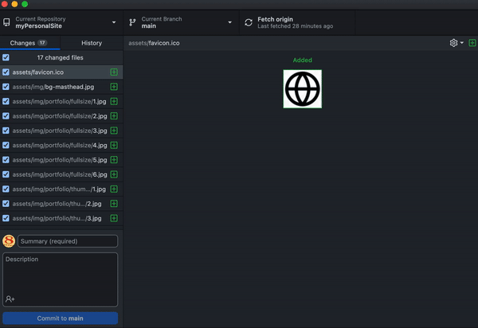
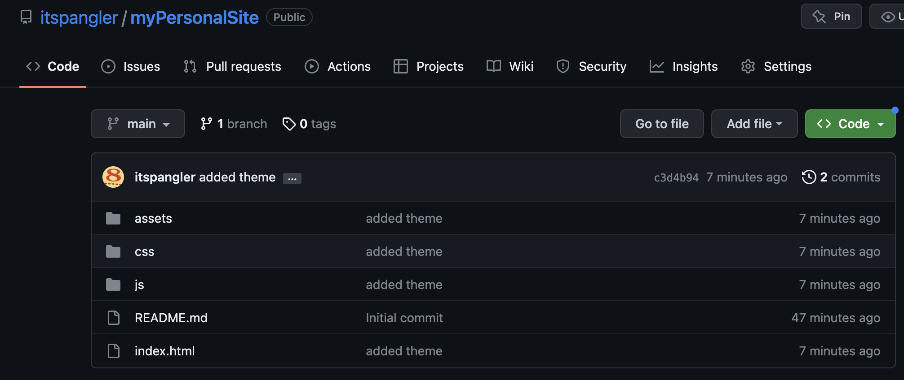

---  

## Creating a new repository with GitHub

Your personal website will live in something that GitHub calls a `repository`, or `repo` for short. Think of it as a project workspace. To create a repo:

1. Navigate to https://github.com
2. Click `New` in the upper left-hand corner of the screen
3. Fill out the required fields for creating a new repository. Be sure to:
    1. Give it a sensible name (you can change it later)
    2. Make it `Public`
    3. Initialize it with a `README` file (this is just a file that describes the site)

  

## Connect to the repo with GitHub Desktop

Now that you have a repo that holding the content that your personal website will serve, it's time to connect that repo to your local machine via GitHub Desktop.

Connecting to the repo---or `cloning`, in GitHub-speak---replicate the contents of the repo on your local machine. Right now, it should just be one folder and one file. Cloning the repo is as simple as a couple button clicks.

First, navigate to your new repo. Then, click the `<> Code` button, and select `Open with GitHub Desktop`.

You'll need to tell GitHub Desktop where the cloned repo will live on your machine. Click `Choose...` and select a location that makes sense to you.

## Finding a template with Bootstrap

Now that you've built the necessary architecture for hosting and updating content for your website, it's time to actually generate that content.

Thankfully, there are many pre-existing templates that you can use to get your site off the ground. [Bootstrap](https://startbootstrap.com/themes?showAngular=false&showVue=false&showPro=false) is a CSS library that contains numerous website templates, including the one that I used ([Creative](https://startbootstrap.com/theme/creative)) for [my site](https://itspangler.com). Let's use that one as an example.

First, download the template by clicking the `Free Download` button on the [template page](https://startbootstrap.com/theme/creative).

Then, unzip the folder and drag all of its contents into your repo, like so:

When you add the files to your repo, notice how GitHub Desktop reflects the changes, listing every single file that was added or changed. In order to accept these changes and move them from our local machine to the internet, we need to `commit` and then `push` the changes to the repo.

## `commit` and `push` with GitHub Desktop

In GitHub-speak, to `commit` means to change or revise a set of files, and to `push` means to transfer commits to a remote repo (e.g., from your computer to the internet). GitHub Desktop allows us to easily commit and push with a couple of button clicks.

To commit and push in GitHub Desktop, simply add a summary and description to your changes---for example, "added theme." Then, click `Commit to main` and `Push to origin`.

This will send your changes to the GitHub "cloud," so to speak. In fact, if you return to your repo online, you should see that all those files have been uploaded, along with a description of what was changed and a timestamp for when the changes were pushed.

---  

# &rarr; [4: Testing and deploying your site](DEPLOY.md)