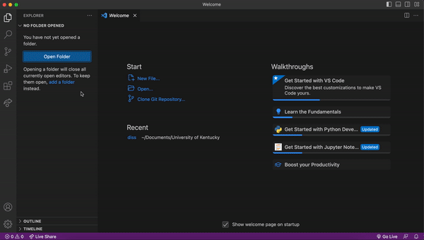
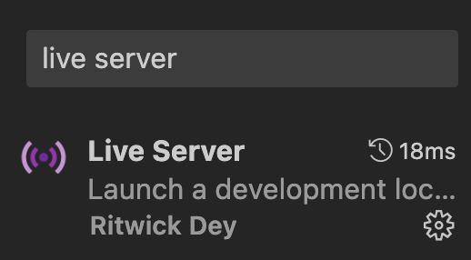
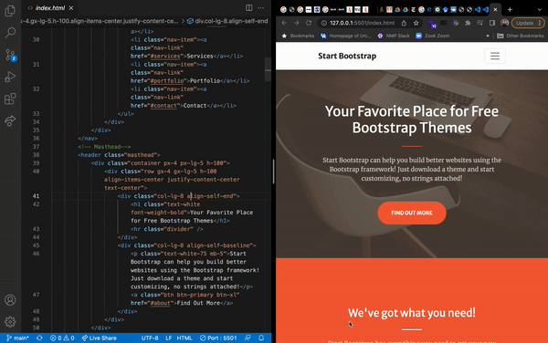

## See it live with VS Code

Any time you need to edit your website, you'll use VS Code. Like most text editors, VS Code has a handy plugin for seeing your work "live" in a local development server. Basically, this means you can see changes to your website reflected in real time as you make those changes in your text editor.

Let's begin by loading your personal website repo as a VS Code workspace. (The word `workspace` has a specific definition in VS Code-speak, and while that definition won't matter a ton for our purposes, you can [learn more about it here](https://code.visualstudio.com/docs/editor/workspaces).)

When you open VS Code for the first time, you'll be prompted to open a folder. Go ahead and click `Open`, navigate to your repo, and load it.

Once it's loaded, click on the `Extensions` button  in the left-hand pane of VS Code. Search for `live server` and install this one:

A little radio button with the words "Go Live" should appear on the bar at the bottom of the VS Code interface after the extension has installed. Click that button; a new tab showing the Creative template will open in your default web browser. Nice!

## Make it yours with VS Code

You can use VS Code's Live Server extension to edit your website and view what those changes will look like in real time.

To get started editing your site, open the `index.html` file in your repo. HTML, or hypertext markup language, is one of the fundamental building blocks of the internet. HTML provides structure and content to a website, so if you want to change the way your website looks, start with `index.html`. (You can read more about [`index.html` files and web directory structure here](https://en.wikipedia.org/wiki/Web_server_directory_index).)

If you've never edited raw HTML before, this might feel a little intimidating. It's beyond the scope of this workshop to discuss how to edit HTML in detail, but Mozilla has excellent introductory docs for [getting started with HTML](https://developer.mozilla.org/en-US/docs/Learn/HTML/Introduction_to_HTML/Getting_started).

For the purposes of this workshop, just find a chunk of text that 

HTML is closely related to CSS---short for cascading style sheet---a language containing instructions for the style in which documents will be presented. HTML tells a browser what kind of content will appear on a page and where that content will go, and then CSS adds all the flavor: colors, fonts, sizes, and so on.

If you want to change these features, you'll need to fuss with the `css/styles.css` file. That file is huge, but it's also really well structured. Once you understand what's going on inside it, changing the details becomes less intimidating.

Let's say we want to change the orange colors in this theme to green. To do so, we need to replace all instances of the orange color with a green color of our choosing. I'm going to go with the dark green `32, 74, 30` as identified by its RGB values. (Try [ColorBrewer](https://colorbrewer2.org/#type=sequential&scheme=BuGn&n=3) for choosing a pleasing color palette. It's for maps, but works for all kinds of design.)

That orange color is currently being set by a field `--bs-primary-rgb`. Removing the orange color is as easy as replacing the current RGB values with ours. Using `cmd+f` on a Mac or `ctrl+f` on a Windows, search for `--bs-primary-rgb` and replace `244, 98, 58` with `32, 74, 30`. Save your changes, and voila!

## Make it real with GitHub Pages

## Extras: Domain names, search engine optimization, and websites-as-a-service

---

# &rarr; [5: Wrap-up](05_WRAP.md)