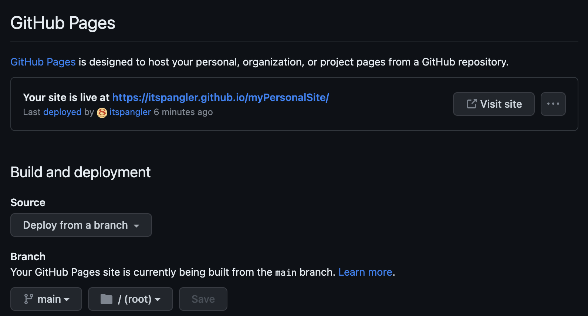

# Testing and deploying your site

---

## See it live with VS Code

Any time you need to edit your website, you'll use VS Code. Like most text editors, VS Code has a handy plugin for seeing your work "live" in a local development server, before it hits the internet. Basically, this means you can see changes to your website reflected in real time as you make those changes in your text editor.

Let's begin by loading your personal website repo as a VS Code workspace. (The word `workspace` has a specific definition in VS Code-speak, and while that definition won't matter a ton for our purposes, you can [learn more about it here](https://code.visualstudio.com/docs/editor/workspaces).)

When you open VS Code for the first time, you'll be prompted to open a folder. Go ahead and click `Open`, navigate to your repo, and load it.

Once it's loaded, click on the `Extensions` button  in the left-hand pane of VS Code. Search for `live server` and install this one:

A little radio button with the words "Go Live" should appear on the bar at the bottom of the VS Code interface after the extension has installed. Click that button; a new tab showing the Creative template will open in your default web browser. Nice!

## Make it yours with VS Code

You can use VS Code's Live Server extension to edit your website and view what those changes will look like in real time.

To get started editing your site, open the `index.html` file in your repo. HTML, or hypertext markup language, is one of the fundamental building blocks of the internet. HTML provides structure and content to a website, so if you want to change the way your website looks, start with `index.html`. (You can read more about [`index.html` files and web directory structure here](https://en.wikipedia.org/wiki/Web_server_directory_index).)

If you've never edited raw HTML before, this might feel a little intimidating. It's beyond the scope of this workshop to discuss how to edit HTML in detail, but Mozilla has excellent introductory docs for [getting started with HTML](https://developer.mozilla.org/en-US/docs/Learn/HTML/Introduction_to_HTML/Getting_started).

For the purposes of this workshop, just find a chunk of text that 

  
OPTIONAL: Style the colors

<h3 id="messing-with-the-template-using-css"> Messing with the template using CSS</h3>

HTML is closely related to CSS—short for cascading style sheet—a language containing instructions for the style in which documents will be presented. HTML tells a browser what kind of content will appear on a page and where that content will go, and then CSS adds all the flavor: colors, fonts, sizes, and so on.

If you want to change these features, you’ll need to fuss with the <code>css/styles.css</code> file. That file is huge, but it’s also really well structured. Once you understand what’s going on inside it, changing the details becomes less intimidating.

Let’s say we want to change the orange colors in this theme to green. To do so, we need to replace all instances of the orange color with a green color of our choosing. I’m going to go with the dark green <code>32, 74, 30</code> as identified by its RGB values. (Try <a href="https://colorbrewer2.org/#type=sequential&amp;scheme=BuGn&amp;n=3">ColorBrewer</a> for choosing a pleasing color palette. It’s for maps, but works for all kinds of design.)

That orange color is currently being set by a field <code>--bs-primary-rgb</code>. Removing the orange color is as easy as replacing the current RGB values with ours. Using <code>cmd+f</code> on a Mac or <code>ctrl+f</code> on a Windows, search for <code>--bs-primary-rgb</code> and replace <code>244, 98, 58</code> with <code>32, 74, 30</code>. Save your changes, and voila!

<figure>
<figcaption aria-hidden="true">Changing background from orange to green in the styles.css file</figcaption>
</figure>

Notice that the button still remains orange. That’s because it’s being set by a different parameter. To determine where that parameter is being set, we can open the inspector in our web browser of choice. As a Google Chrome user, I right click on the page and click <code>Inspect</code>. When I hover my cursor over the button and click it, the inspector reveals where that color is being set: in the <code>btn-primary</code> class.

If I hop over to VS Code and search for <code>btn-primary</code> in the <code>styles.css</code> file, it quickly finds the place where I can change the color. VS Code even has a handy color picker built into the editor that you can use.

<figure>
<figcaption aria-hidden="true">Changing buttons from orange to green in the styles.css file</figcaption>
</figure>

## Make it real with GitHub Pages

In order to actually serve your page as a website, you need to configure it with GitHub Pages. Thankfully, this entire process can be completed within the GitHub web client.

Navigate back to your personal website repo in the GitHub web client, and click `Settings`. From there, click `Pages` in the left-hand sidebar. Within the "Build and Deployment" section, you'll see a message that says "GitHub Pages is currently disabled." To change that, change the Branch from `None` to `Main` and click `Save`.

It might take a minute for the site to generate, but keep refreshing the page. When the site is ready, a message will appear with a stable URL to your new site:

Now you can share your site widely!

---

---
### &larr; [3: Ingredients for building your own site from scratch](03_INGREDIENTS.md)
# &rarr; [5: Wrap-up](05_WRAP.md)